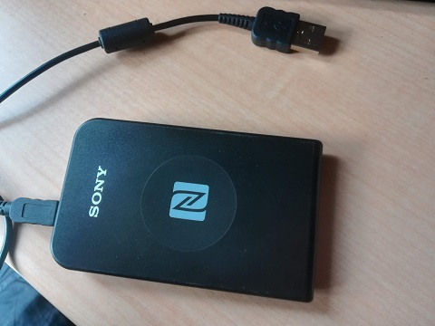
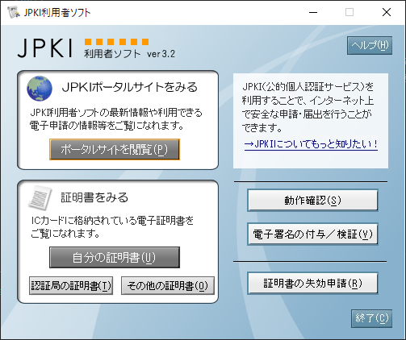
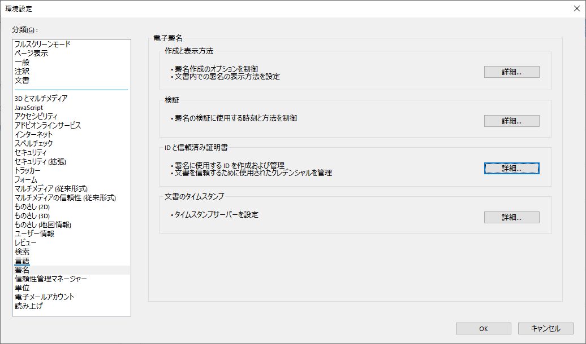
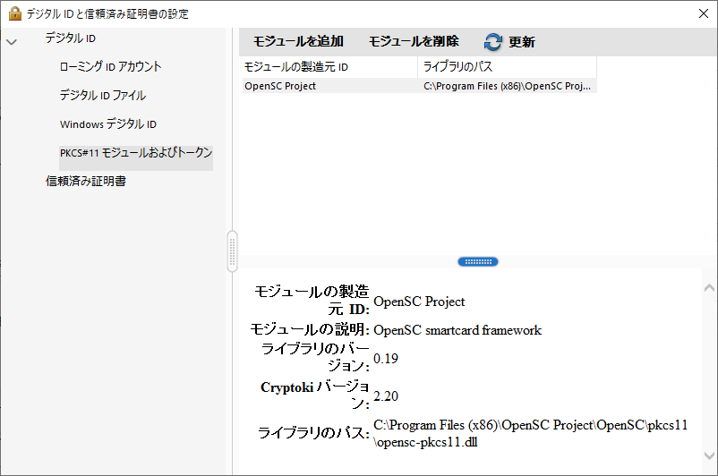
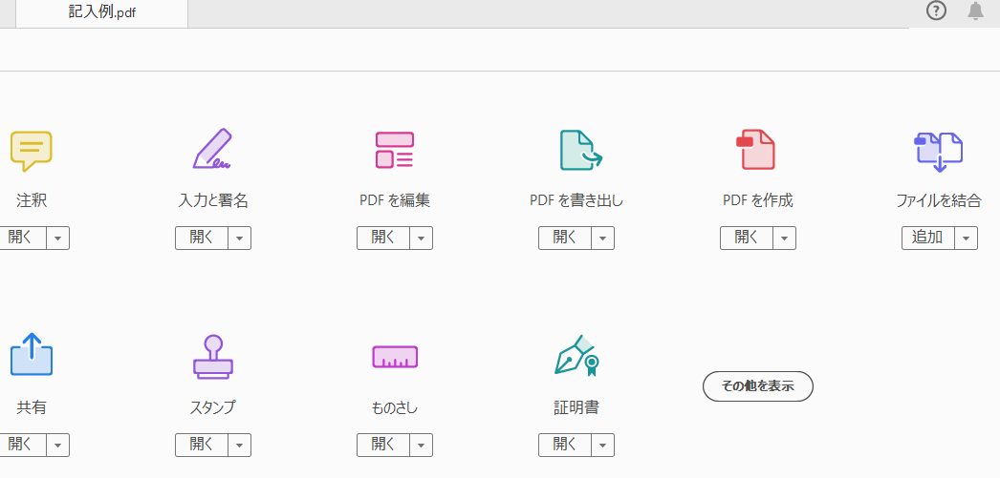
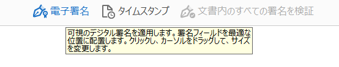
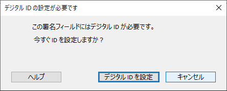
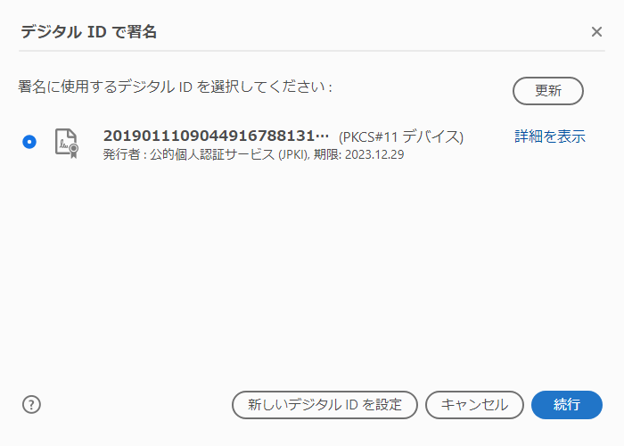
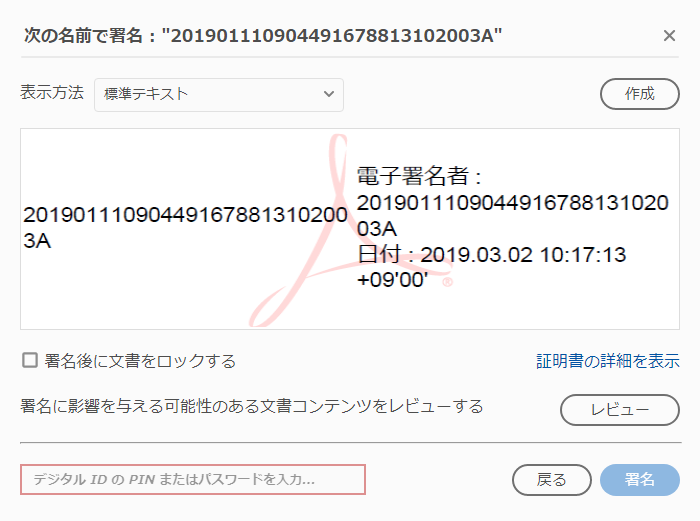
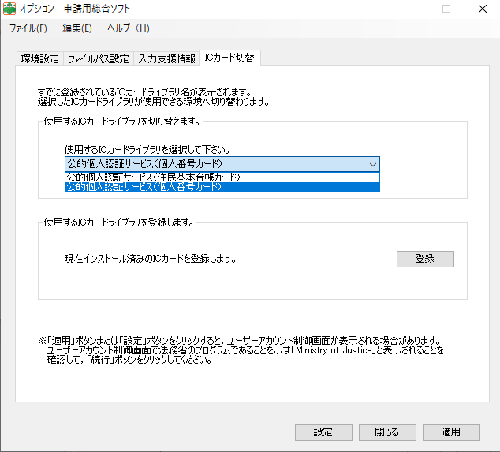

# 個人番号カード（マイナンバーカード）の電子署名をAcrobat Readerを使って無料でする方法

## はじめに

皆さん個人番号カード、使ってますか？

マイナンバーカードと個人番号カード、呼び名が2つあってわかりづらいあのカードですが、本記事では以後個人番号カードと呼称します。

この個人番号カード、住民票をコンビニでとれる、身分証明に使えることがある、以外の売りの1つとして、公的個人認証サービスを使って電子署名ができる点があげられます。

公的個人認証サービスは[こちら](https://www.jpki.go.jp/)を御覧ください。

 

電子署名は、主に公的機関に書類を電子で提出する際、その書類が間違いなく本人が作成したものであるという証明として使えるものです。

使いこなすことができれば、役所に行く時間を節約できますし、政府も電子化を進めたい関係で全体的に手数料がお安くなる傾向があるので、出費を抑えられます。

 

最も必要性に迫られるのは、法人を登記する際の電子定款の作成でしょうか。

こちらは法務省が公式に「完全オンライン申請をオススメ」している他、費用が4万円くらい抑えられます。

[法務省のページ](http://www.moj.go.jp/MINJI/minji06_00117.html)より抜粋します。

> 一人株式会社又は一人合同会社（以下「一人会社」といいます。）を設立する場合は，公的個人認証サービス電子証明書を取得すれば，申請書情報及び全ての添付書面情報に必要な電子署名を付与できますので，添付書面を管轄の法務局に別途持参等することなく，設立登記を完全オンラインで申請することができます（なお，この場合には，株式会社の設立登記には，公証人の認証を受けた電子定款を添付する必要があります。）。

ただ、こちらのページにもありますが、引っかかるのが以下の記述です。

> 登記・供託オンライン申請システムのホームページからダウンロードできる「PDF署名プラグイン」を利用して，添付書面情報のPDFに電子署名を付与することができます（なお，「PDF署名プラグイン」の利用に当たっては，Adobe Acrobat（有料）を別途用意する必要があります。）。　

電子署名をするには**有料の**Adobe Acrobatが必要とはっきり書いてあります。

電子定款を使うと設立費用を4万円浮かすことができますが、Adobe AcrobatはDC（Document Cloud）というライセンスで購入するのが一般的で、月額1000円以上かかります。

電子定款にしても、何度か修正することを考えれば設立時に1000円払って差し引き3万9千円お得という単純な話にはならないですし、せっかく署名できる環境を作ってすぐに捨てるもったいない話にもしたくないので、Acrobatを契約し続けるかどうかで検討する方が多いと思います。

結果的に、電子定款が便利かどうかではなく、高いか安いかという軸で、アナログを選んでしまう方も多いでしょう。

 

そこで本記事では、[Adobe Acrobat Reader](https://get.adobe.com/jp/reader/)という無料のソフトを使って電子署名をする方法についてご説明します。

登記・供託オンライン申請システムの[PDFファイルに電子署名する際の留意事項について](https://www.touki-kyoutaku-online.moj.go.jp/cautions/append/sign_pdf.html)というページには以下の記述があります。

> Adobe Acrobat Readerの電子署名機能を使用して作成した「電子署名付きPDFファイル」
>　なお，一部のICカードタイプの電子証明書は，Adobe Acrobat Readerの電子署名機能を使用できない場合がありますので，ご利用の電子証明書のお問合せ先にご確認ください。

Acrobat Readerで電子署名をした文書は公式に認められています。

一方、個人番号カードで署名できるんだかできないんだかよくわからない記述が書いてあり、調査した結果このページにたどり着く人もいると思われます。

「使用できない場合」という事はまるで普通は使用できるように読めますが、普通にはできません。**手間はかかりますができます**といった辺りが正確だと言えます。

本記事が、Acrobatの費用を節約したいために個人番号カードでの電子署名の導入が進まないという状況の解決に、少しでも役に立てば幸いです。

## 事前の準備

個人番号カードでの署名は、公的個人認証サービスというものを使うことになります。まずは公式のページの[事前の準備](https://www.jpki.go.jp/prepare/index.html)に沿って準備しましょう。

マイナンバーカード（個人番号カード）を用意し、電子証明書を用意し、ICカードリーダライタを用意するそうです。

 

電子証明書は、個人番号カード申請時に拒否しない限りは入っています。発行に時間がかかる事があるので、早めに手続きをされるのをお勧めします。

 

次にICカードリーダライタですが、RC-S380が2019年2月現在は一般的です。PとかSとかありますが、私はPを買いました。

こういう、素朴なリーダーです。[ヨドバシ.com](https://www.yodobashi.com/product/100000001001606486/)とかで買えます。

ドライバのセットアップ等があるので、実はこの辺りでつまずいていて後の手順の失敗につながらないよう、セットアップが正しく完了しているかの確認用にSuicaやPasmoの残高確認を手元で実行しておくのをお勧めします（これはこれで、できるようになっておくと地味に便利です）。

 

続いて案内される手順は[利用者クライアントソフトのインストール](https://www.jpki.go.jp/download/index.html)です。JPKI利用者ソフトというようなので、以後はそのように呼称します。

実はPDFの署名だけを考えればこの手順は省略できますが、署名したPDFを後で公的機関に送る事や、これから先の手順の前になんらかのミスが起きてないかを確認するためにも、素直にやっておきましょう。

インストールが完了したら、JPKI利用者ソフトを起動し、一度個人番号カードを確認しておくことをお勧めします。

起動すると以下の画面が出ます。

ICカードリーダを接続し、個人番号カードをリーダの上に置いた後、自分の証明書 -> 署名用電子証明書と進み、個人番号カードに入っている署名用電子証明書が、JPKI利用者ソフト上では正しく動作していそうな点を確認しておいてください。

## Adobe Acrobat Readerのインストール

インストール済の方も多いと思いますが、今回はAdobe Acrobat Readerを利用しますのでインストールしておいてください。

[Adobe Acrobat Reader](https://get.adobe.com/jp/reader/)

ついでに色々入ったりする人もいると思いますが、必要なのはAcrobat Readerだけなので他のものは消してしまって大丈夫です。

色々とやる前に、署名対象の文書がインストール後のAcrobat Readerで開けるか確認されておく事をお勧めします。

## OpenSCのインストール

続いて、OpenSCというソフトをインストールします。

OpenSCは、オープンソースで開発されている個人番号カードを含むスマートカードのマルチプラットフォーム対応のミドルウェアです。

本記事では、Acrobat ReaderとOpenSCを連結させることで署名する手順をご紹介するので、このOpenSCが肝になってきます。

以下のサイトからダウンロードしインストールをしてください。Acrobat Readerで認識できる環境の関係で、少なくともWindows環境においては**64bit OSの方も32bit版をインストールする必要がある**点に注意が必要です（Macは試せてません）。

[https://github.com/OpenSC/OpenSC/wiki](https://github.com/OpenSC/OpenSC/wiki)

`OpenSC-win32_0.19.0.msi`、等のリンクからインストールする事になります（0.19.0の部分はOpenSCのバージョンなので、作業を実施する日付によっては変わっていると思います）。

 

インストールオプションなどを聞かれると思いますが、`Typical` を選択で大丈夫です。

インストールが完了したら、こちらも動作確認をしたいのですが、少し上級者向けの手順になるので、以下の記述は「コマンドプロンプト」などの単語でピンと来ない方は読み飛ばしていただいて問題ありません。

必ずJPKI利用者ソフト等を終了した後でコマンドプロンプト等を起動し、`C:\Program Files (x86)\OpenSC Project\OpenSC\tools` 等、OpenSCのインストールされている環境下のtoolsディレクトリに`cd`してください。

`opensc-tool -a` で`Sony FeliCa Port/PaSoRi 3.0`等と表示されれば、リーダーの認識に成功しています。

`pkcs15tool --dump` 等でいろいろ情報が出てきて、特に上の方で`Manufacturer ID`で`JPKI`と出てきていれば、個人番号カードを確実に認識できています。

この手順で上手く個人番号カードが認識できない方は、後述の[はまりどころ](#はまりどころ)にある[OpenSCがポートを見つけられない](#opensc%E3%81%8C%E3%83%9D%E3%83%BC%E3%83%88%E3%82%92%E8%A6%8B%E3%81%A4%E3%81%91%E3%82%89%E3%82%8C%E3%81%AA%E3%81%84)もご一読ください。

## Acrobat Readerの設定

続いて、Acrobat Readerの設定です。

更新の多いソフトウェアのUIが絡む話なので、Acrobat Readerのバージョンによって、項目の場所は少し違う事があるかもしれません（この文書作成時点で、Windows版Adobe Acrobat Reader DC - Japanese (19.010.20098)というバージョンを使っています）。都度、読み替えて下さい。

Acrobat Readerを起動後、メニューから「編集」→「環境設定」と選び、開いたダイアログの「署名」項目を選択後、右側にある「IDと信頼済み証明書」欄の「詳細」を選択してください。

`PKCS#11 モジュールおよびトークン`という項目があるので、選択後出てくる「モジュールを追加」を選択してください。

 

この際、モジュールの追加がグレーアウトされて押せない場合、おそらくAcrobat Readerが保護モードで実行されてしまっています。

少し触っていると保護モードを解除するか確認するダイアログが出るのでダイアログの指示に従うか、「編集」→「環境設定」後「セキュリティ（拡張）」から保護モードを無効にしてから再起動する等してからやり直してみてください。

保護モードはセキュリティ上有効な方が好ましいので、用が済んだら元に戻しておくことをお勧めします。

 

無事「モジュールを追加」が押せたら、ファイルを選択するダイアログが出てくるので、`C:\Program Files (x86)\OpenSC Project\OpenSC\pkcs11` 等、OpenSCがインストールされているディレクトリの下のpkcs11ディレクトリを選択し、`opensc-pkcs11.dll`を選択してください。

下図のような画面になれば成功です。

利用したいのは自己署名の機能なので、サブメニューのOpenSC smartcard frameworkを選択し、Digital Signature PIN (JPK)で「ログイン」をして、6桁～のパスワードを入力することでログイン状態になれることを確認しておくのをお勧めします。

## いざ署名

さて、署名してみましょう。

署名したいPDFファイルを開き、右のメニューの「その他のツール」から「証明書」を選択してください。

画面上にある「電子署名を選択」を押します。

電子署名選択後、PDFの適当な場所をドラッグしてください。

ドラッグした後に「デジタルIDの設定が必要です」で出てきたら失敗してます。この場合は再起動する、リーダーの接続と個人番号カードのセットを確認する、他のソフトを終了してから再起動する等を試してみてください。

`PKCS#11 デバイス`が出ていれば成功です。

PKCS#11デバイスを選択して、「続行」を選択してください。

署名の表示方法を選ぶところが出てきますが、ここから先は特に公共機関からも指定がありません。というのも、電子署名は表示内容はさして重要ではなく、署名した結果内部に埋め込まれるデータの方が重要なので、表示はなんでもいいからです。

 

先述の署名プラグインでは画像だけになっているので、デフォルトの長いテキストのままが嫌な場合（私は嫌でした）、表示方法右の「作成」から署名の表示方法をカスタマイズします。

詳細は割愛しますが、私は「含めるテキスト」をすべてチェックを外して、「画像」から適当な正方形で、ハンコを意識して赤丸に自分の名前を入れただけの画像を設定しました。

表示の変更は後でもできるので、ここでは飛ばしてしまってもいいと思います。まずは署名してみましょう。

 

表示方法の選択が済んだら、先ほどの手順でログイン済の方は省略できますが、通常は左下端のPINまたはパスワードの入力欄に、例によって6桁～のパスワードを設定する必要があります。入力して、右下の「署名」ボタンを選択してください。

署名後のファイルを保存する場所を聞かれるので、現在のファイルとは別のファイル名を設定し、保存します。

これで、署名済PDFの作成は完成です！

 

もう一度署名する際に、また表示方法を聞かれますので、表示方法はいくらでも変更できます。

一度保存すれば以後は再利用できるので、表示方法を自分好みにカスタマイズしてから正式な文書作成に進むのをお勧めします。

## 署名の検証

署名済PDFを開くと、署名に問題がある旨が表示されると思います。

通常、署名を検証する必要は特にないのですが、エラーが出ているとちょっと気持ち悪いかもしれません。また、もしかしたら自分が署名する以外に、署名されたファイルを開く事もあるかもしれません。

以下のサイトで解説されている方法で、エラーを取り除く事ができます。気になる方は実施してみてください。

[電子署名を検証するには](https://jpki.osdn.jp/validation.html)

 

現在のバージョンのAcrobat Readerでは、取り込み後に証明書に対する信頼という作業をするのではなく、取り込み時に信頼済証明書として取り込むという手順になると思います。

上手く信頼済にできなかったら、取り込みからやり直してみるといいでしょう。

必須な手順というわけではないので、ここでは簡単な解説にとどめます。

## はまりどころ

### OpenSCがポートを見つけられない

ご利用の環境によっては、OpenSCがポートを見つけられない可能性もあります。

私の環境のLet'snote CF-S10にはF5521gw Mobile Broadcast Modemというモデムがついていたので、これと競合して上手く認識しませんでした。

特に利用していないものであれば、デバイスマネージャーから該当するデバイスを無効化してしまえば動くようになります。

### PDF署名はできるけど申請用総合ソフト等で署名ができない

この問題は、私は申請用総合ソフトで何度も遭遇しています。多分他のソフトでも起きやすいです。

そもそも申請用総合ソフト等はエラーになりやすいので、そういうものだと思って根気強く対応しましょう。

 

まず疑われるのが、OpenSCとJPKI利用者ソフトが競合してしまっている問題の可能性です。

Acrobat Readerと、該当ソフト、それにJPKI利用者ソフトをまずは一式閉じてください。

それから、該当ソフトだけを起動し、署名をしてみてください。

これで駄目なら単体の問題です。駄目でも**そういうもの**なので根気強く対応しましょう。

 

申請用総合ソフトの場合、駄目な時はまず一度再起動することをお勧めします。

再起動前にICカードリーダーを接続し、その上にマイナンバーカードを置いて準備を万端にしておいてください。

再起動後、メニューから「ツール」→「オプション」と選択し、ICカード切替というタブを選択します。

ここで「使用するICカードライブラリ」に「公的個人認証サービス（個人番号カード）」を選び、必ず「設定」を選択してください（私は「適用」をしても上手くいかない問題にはまった事があります）。

この操作直後に署名を行って、ダメならもう一度再起動して同じ手順をやってみてください。3回やってダメなら別のエラーだと思いますが、**3回くらいやればできることもある**という認識を持つ事が重要です。

別のエラーの場合、公式の文書を読んでひとつずつ手順を確認しつつやってみてください。

 

この辺、もうちょっと何とかなってくれるとありがたいのですが、**そういうもの**です。

## 他の方法

### JPKI PDF SIGNER

以下のページで案内されている方法もあります。

[マイナンバーカードを使ってPDFに電子署名をしよう！](https://jpki.osdn.jp/)

このページのオーナーの方が、オープンソースでJPKI PDF SIGNERというソフトを公開しています。

私の環境では、試した当時はWindows Defenderに引っかかってしまいました。2019年2月17日、作者の方が気付いて更新版を配布しているようです。

オープンソースなので、私もソースコードを軽く拝見しましたが、特に悪さはしていないように見えますが、私も試してはいません。ご利用は自己責任で。

 

少しだけ私見を述べると、JPKI PDF SIGNERは、PDFに署名したいだけの目的のソフトウェアとして正しい方向で設計されています。

一方で、中でJPKIのライブラリをJNI経由で呼び出すという、ライセンス上かなりグレーな行為をしているのと、先述の[PDFファイルに電子署名する際の留意事項について](https://www.touki-kyoutaku-online.moj.go.jp/cautions/append/sign_pdf.html)に掲載されていないやり方になるので、政府公認にならないと継続的に利用するべきかは難しいところではないかなと思いました。

### 個人番号カードを使わないで署名する

セコム等から証明書を取得すれば、個人番号カードに頼らずに署名ができるようです。

司法書士の方などは結構こういった方法も利用されているようですね（そういった代替手段をとれてしまうので、なかなか改善されないのでしょうけど）。

Acrobatは使いたくないが初期費用はかけてもいいという方は、証明書の取得を検討されるのもいいと思います。

## 終わりに

政府が`署名プラグイン for Adobe Acrobat Reader`か`PDF署名ソフト`を配布してくれることを期待しつつ、この複雑な手順で救われる方が少しでもいれば幸いです。

色々と批判の多い個人番号カードですが、日本は大分電子認証が遅れてしまっており、それを少しは前進させてくれているものです。

私達も新しい取り組みを毛嫌いせず、また使えそうなものに完璧を求めすぎず、なるべく積極的に使っていくと建設的な議論になって国のIT化も促進されていくので、辛抱強く付き合っていくといいんじゃないかなと思ってます。

 

また、今回こういった裏口が使えたのは、OpenSC並びにOpenSCに個人番号カードをサポートできるよう尽力してくださった[hamanoさん](https://github.com/hamano)のお蔭です。個人番号カードとOpenSCの発展と応用の推進にも期待しつつ、本記事を終わりにしたいと思います。

 

長文にお付き合いいただきありがとうございました。
